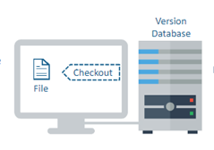
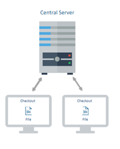
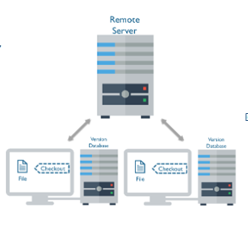
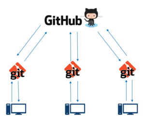
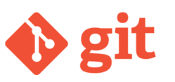

# Python and Automation testing

Moving forward:
QA analyst - fundamentals, tools (sql, linux), automation(optional), finance, interview -> market (80-110)
QA Engineer/Analyst - fundamentals, tools (sql, linux), automation, finance, interview  -> market (90 - 110)
QA Engineer - fundamentals, tools (sql, linux), automation(some additional), finance, interview (ask Akmal) -> market (95-120)

BA/QA or BA - fundamentals, tools (sql, linux), automation(optional), BA class, finance, interview  -> market  (100-150)
			- automation is optional more concentrate to BA ( ask Said)

--------------------

### Reading:
1. Full stack development?
2. Top 10 programming languages: https://www.northeastern.edu/graduate/blog/most-popular-programming-languages/
3. What is http? 
	- https://www.w3schools.com/whatis/whatis_http.asp
	- https://developer.mozilla.org/en-US/docs/Web/HTTP/Overview (basics of API)
	- https://www.tutorialspoint.com/http/http_messages.htm
4. What is API? 
	- https://rapidapi.com/blog/api-glossary/api-call/
	- https://www.quora.com/What-is-an-api-call

--------------------
### Text Editors:
- in linux: VI editor, Nano etc. (editors for code)

Applications that helps to write a code (IDE - integrated development Environment):
PyCharm (Jet Brains), IntellijIdea (java, Jet Brains), Eclipse (java )
VisualStudio Code(), Visual Studio (for c#)

- help you write a code, help you to complete your syntax
- assist in idenfying syntax errors, importing (usage of external files)


https://www.wired.com/story/health-fitness-data-privacy/


-----------------------------------------------

## 03/06/2021 Agenda: Lists in Python

- Code refactoring
	In computer programming and software design, code refactoring is the process of restructuring existing computer code—changing the factoring—without changing its external behavior. Refactoring is intended to improve the design, structure, and/or implementation of the software, while preserving its functionality.

- Pycharm shortcuts: 
	Autoformatting: ctrl + Alt + L based on PEP-8 Style Guide:
	https://www.python.org/dev/peps/pep-0008/


### What is Data structures?
	In computer science, a data structure is a data organization, management, and storage format that enables efficient access and modification.[1][2][3] More precisely, a data structure is a collection of data values, the relationships among them, and the functions or operations that can be applied to the data.
	
	A data structure is a particular way of organizing data in a computer so that it can be used effectively.
	
	Reading on Data structures: 
	https://www.integralist.co.uk/posts/data-types-and-data-structures/
	https://towardsdatascience.com/8-common-data-structures-every-programmer-must-know-171acf6a1a42
	
For example, we can store a list of items having the same data-type using the array data structure.

### what is list?
	odds = [1, 3, 5, 7 ]
	new variable
	vowels = ['a', 'e', 'i', 'o', 'u']
working with lists
create, edit, remove, access

-----------------------------------------------
## 03/07/2021
## Working with lists (continue)

Temporary sorting:
- new_list = sorted(list)
- new_list_rev = sorted(list, reverse=True)

Permanent sorting:
- list.sort()
- list.sort(reverse=True)
- list.reverse()

Types of Errors we can see dealing with list? IndexError: list index out of range
What is object? What is iterable? what is return statement? why I have None on print() functions?


Looping through the list: 
for odd in odds:
	print(odd)

concatenate in the loop

- Indentation Errors
	in the loop
	outside the loop
	not a loop

- colons

Next class Agenda:
- Making Numerical lists:
	range()
	list(range(1, 5))

- Statistics: 
	min(), max(), sum()
	
- list comprehensions

------------------------------
## 03/13/2021
### 1. Styling the code
PEP 8 -- Style Guide for Python Code
autoformatting in pycharm - ctrl + alt + L
Line Length

### 2. Working with part of a list
Slicing
Copying the list

### 3. Tuples

### 4. If statement
    - various expression that we can use in if statement
    - using simple comparison (numbers, strings, etc)
    - using 'in' operator with range() function
    - using 'in' operator with lists
    - if statement in for loop

### Agenda for next class (03/14/2021):
- if statement with multiple conditions
- if statement with multiple 'elif' statements
- using multiple lists (using pizza example)
- Some problem solving examples

### Homework:
Implement sum() with for loop
Double characters in a string (e.g. “abc” => “aabbcc”)
for letter in "hello":
    print(letter)
Prove that a number is a prime
Prove that a string is a palindrome (mom, dad, madam, kayak etc)

#### Websites to practice problem solving:
- [click  here](https://codingbat.com/python) 
- [blah blah](https://www.google.com)

## Agenda: 03/20/2021
- dictionaries - new data structure (1-2)
- looping in dictionary
- dictionary/list with list/dictionary as a value

#### H/W
- 6-6. Polling:
- print multiplication table
- 6-7 to 6-12

## Agenda 03/21/2021
- Keywords to note: stack, buffer
- while loop ( 0.5)

### H/W
a. exercises for problem solving:
1. How to swap 2 variable values. e.g.: a=45 b=78 >> a=78 b=45
2. Count the vowels ('aeuoi') in any phrase/sentence/word.
user enters any phrase, you return:
print(f"number of {vowels}'s is : {count}")
3. Count each letter in any phrase
   
    Pseudocode:
    - loop through the text
    - create a dictionary for this letters
    - add each letter to the dictionary as a key and count (starting from 0) as a value
    - every time you add a letter to a dictionary check if dictionary has the same key, if dictionary has a key you increment the value
    if dictionary does not have you create new element and value = 1
    a: 1+1, d: 1+1, e: 1

    - how to find mostly used letter in the text:
    you have a dictionary now, you need find out what is the largest value(count) and print/return the key of that value


4. Find the first mostly used letter in a phrase.
    (max(), dictionary, add to dictionary, if the key is in the dictionary, increment)

b. Exercise from the book:
    7-8. Deli:
    7-9. No Pastrami:
    7-10. Dream Vacation:

## Agenda Functions (1-2) - Chapter 8

### H/W Exercises from the book:
- 8-3. T-Shirt:
- 8-4. Large Shirts:
- 8-5. Cities:

## 03/25/2021
Agenda:
Functions Return values (ignore arbitrary arguments)
method is the same thing as function
Method is used in the context of Java, C++, C#

#### HW:
- 8-6. City Names:
- 8-7. Album:
- 8-8. User Albums:


## 03/27/2021:
Agenda: 
- Functions 

### Functions (continue)

|-3| = 3 >>> abs(-3) =3

Primitive data type: float, integer, string, boolean
Data structures: dictionary, list, tuples

**Modules**
 - files containing your python functions

Importing modules to reuse your function anywhere in the project
Packages
ctrl + alt + o - to optimize the imports in the module

Imports:

```python
import time
import functions.functions_return
import functions.functions_return as ft

from time import sleep
from functions.functions_return import print_formatted_name
from module_name import function_0, function_1, function_2

from time import *
from functions.functions_return import *
```

## 03/28/2021
Agenda:
- Classes and object (Chapter 9)

### Classes and object 
Object-oriented programming concepts:
- class - blueprint or template code for replicating real-world things or situation, it will have state (attributes) and behavior (methods - functions)

- object - instance of the class; it is a variable that will have an access to class state and behavior, this is used to execute the class functions

- constructor - it is \__init__()  method(function), it is initializing method in the class, this will help python to define the class on execution

- self - this is the keyword that identifies current class, it shows that attributes and functions are class level or belongs to class.
    super() - refers to parent class (when inheritance is used).

- instance variables - variable defined in the constructor (attributes)

- class names should be with upper case:
    Car() is good, car() is not good

- instantiation - process of creating an object of the class

- encapsulation - hiding data from object (users)

#### HW:
- read chapter 9
- exercises: from 9-1 to 9-5

### Agenda:
- Class: inheritance
Inheritance works one way from parent class to child class, not other way around.
- we can reuse all attributes and methods from parent class
- we can create new attributes (available to child only)
- we can create new methods(functions, available to child only)
- we can override the method that parent had (OOPs - Method Overriding)

#### HW: all exercises from chapter 9 (9-1 to 9-9)

## 04/04/2021
Agenda:
- Exercises and Q & A
- Working with Files
- Handling Exceptions

#### HW:
- all exercises in Chapter 11
- read about exception handling
- sign up for GitHub and read about version control systems

## 04/08/2021 
Agenda: markdown language files and version control system

**Current Class organization in the GitHub: https://github.com/2020Fall2**


### Mark down language files

You can find detailed documentation [here](https://www.markdownguide.org/cheat-sheet/)
   

## Version Control

Version Control refers to a system that records changes to a file or set of files over time, called the ‘versions’. In other words, these versions help you in tracking the changes in your codes/project and if necessary, undo those changes as well.


 
There are three types of version control.
- Local Version Controls
- Centralized Version Controls
- Distributed Version Controls

### Local Version Controls
 
Version database or file is present on a local computer. Multiple people cannot work parallelly on the same project.
 
 
 
### Centralized Version Controls
 
In CVC, a central repository is maintained where all versions are kept, and a user can check out and check-in files from their different computers at any time.
 

 
The issue with CVC is that in case of central server failure, the whole system goes down. However, the solution is a distributed Version Control.
 
### Distributed Version Controls
 
Version database or file is stored at every user’s local system and at remote servers. If any of the servers dies, a client-server user can be used to restore the data.
 
 
  
### Issues with software development without Version Control
Once saved, all the changes made in files are permanent and cannot revert back.
There is no record what was done and by whom.

## GIT and GitHub (based on Linux). Slide week 7
  
1. Install git system on your computer.
go to [this](https://git-scm.com/downloads) location to download the git.
make sure you have git bash terminal (linux)

2. Go to github.com and create and account

**You can print out this cheat-sheet for basic git command:
[cheat-sheet](https://training.github.com/downloads/github-git-cheat-sheet/)**

Git is a distributed version control software which you need to install on your local system in order to use it. For an individual working on a project alone, Git proves to be excellent software.



GitHub is a web-based Git version control repository hosting service. It provides all of the distributed version control and source code management (SCM) functionalities of Git.


|   GIT | GITHUB |
|------------------|-------------------|
|It is a software   |It is a service    |
|It is installed locally on the system|  It is hosted on Web|
| It is a tool to manage different versions of edits, made to files in a git repository | It is a space to upload a copy of the Git repository |
|It is a command-line tool|  It provides a graphical interface|


#### Workspace Copy
 Users' active directory simply creates new files in this space and this will be tracked by the Git.
 
#### Stage Area
 It is a place where all the modified files marked to be committed are placed.
 
#### Local Repository
 User’s copy of the version database or file and access all the files through local repos and push the change made to remote
 
#### Remote Repository
 It is a server where all the collaborators upload changes made to files.
 
#### Clone Command
 Creates a copy of an existing remote repository inside the local repository.
 
#### Commit Command
Commits all files from the staging area to local Repository
#### Push Command
Pushes all the changes made in local to Remote Repository
#### Fetch Command
Collects the changes from Remote Repository and copies them to Local Repository but doesn't affect our workspace
#### Pull Command
Collects the changes from Remote Repository and copies them to Local Repository along with merges to the current directory or our workspace

### Here are the links to practice : 
- https://learngitbranching.js.org/
- https://www.katacoda.com/courses/git
- github for previous class: [spring 2020 repository](https://github.com/2020spring)

## Agenda for Next classes
- Selenium WebDriver : working with automated browser
